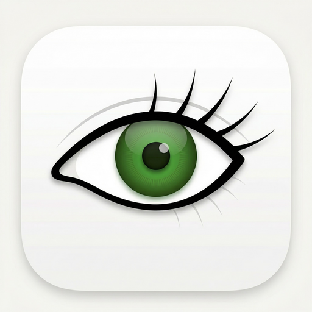

<div align="center">
  
  <h1>AwakeBar</h1>
  <p><strong>Minimal macOS menu bar control for sleep behavior</strong></p>
  <p>Fast toggles. Clear states. No credential storage.</p>
  <p>
    
    
    
  </p>
  <p>
    <a href="#install-and-run-release">Install</a> •
    <a href="#what-each-mode-does">Modes</a> •
    <a href="#menu-controls">Menu</a> •
    <a href="#asset-handoff-for-designers">Designer Handoff</a>
  </p>
</div>

## Overview

AwakeBar is a menu bar utility for controlling when your Mac sleeps.

It provides a single primary control:

- `Full Awake` (ON): keeps your Mac awake with the lid open and with the lid closed.
- `Off`: restores normal macOS sleep behavior.

## Visual Identity

Current icon pack: `HERMES Green` (20x20 menu SVGs + refreshed full-color app icon set).
Runtime status icon set is intentionally two assets only: `awakebar-off.svg` and `awakebar-closed.svg` (lock = Full Awake ON).

| App Icon | Menu Bar OFF | Menu Bar ON |
|---|---|---|
|  | Gray ring indicator | Blue ring + blue center indicator |

## What Each Mode Does

| Mode | Behavior | Admin Prompt | Best For |
|---|---|---|---|
| `Off` | Restores normal macOS sleep behavior | No | Default energy-saving behavior |
| `Full Awake` | Enables open-lid assertions and closed-lid sleep disable (`pmset -a disablesleep 1`) | One-time helper setup + approval in System Settings (if not already approved) | Long-running tasks that must not sleep |

## Menu Controls

- `Status`: shows `Awake is OFF`, `Awake is ON`, or transitional `Turning ON/OFF...`.
- `Full Awake`: one toggle for all awake behavior.
- `Finish Setup...`: appears when helper approval/setup is required.
- `Inline message`: explains setup blockers or helper errors in menu context.
- `Quit AwakeBar`: exits the app.

Hover the `Full Awake` toggle to view quick inline help text.

## Closed-Lid Setup

`Full Awake` requires privileged helper registration for the closed-lid portion.

1. Install `AwakeBar.app` in `/Applications`.
2. Open AwakeBar and turn `Full Awake` ON.
3. If prompted, click `Finish Setup...`, then approve the helper in `Login Items`.
4. Return to AwakeBar and toggle `Full Awake` ON again.

Architecture details:

- Helper registration uses `SMAppService.daemon(plistName:)`.
- Runtime control uses XPC (`com.dshakiba.AwakeBar.PrivilegedHelper.v2`) with code-signing requirements in both directions.
- Runtime does not use `sudo`, AppleScript, or Touch ID/PAM mutation fallbacks.

## Safety

- `Full Awake` can increase thermals and battery drain, especially when the lid is closed.
- AwakeBar does not save or cache admin credentials.
- Closed-lid control uses a scoped privileged helper with a fixed command surface.
- Legacy `sudoers`/PAM artifacts from prior versions are backed up and cleaned once helper setup is healthy.
- If helper state is unavailable, AwakeBar keeps Full Awake OFF and shows an inline reason.

## Requirements

- macOS 14.0+
- Xcode 26.2+
- Swift 6
- `xcodegen` (`brew install xcodegen`)

## Install and Run (Release)

```bash
cd /Users/dshakiba/sleepcomputer
xcodegen generate
xcodebuild -project AwakeBar.xcodeproj -scheme AwakeBar -configuration Release -destination 'platform=macOS' build
APP_PATH="$(xcodebuild -project AwakeBar.xcodeproj -scheme AwakeBar -configuration Release -showBuildSettings | awk '/TARGET_BUILD_DIR =/{dir=$3} /FULL_PRODUCT_NAME =/{name=$3} END{print dir"/"name}')"
rm -rf /Applications/AwakeBar.app
ditto "$APP_PATH" /Applications/AwakeBar.app
open /Applications/AwakeBar.app
```

## Developer Workflow

```bash
# Generate project
xcodegen generate

# Build debug
xcodebuild -project AwakeBar.xcodeproj -scheme AwakeBar -destination 'platform=macOS' build

# Run tests
xcodebuild -project AwakeBar.xcodeproj -scheme AwakeBar -destination 'platform=macOS' test
```

## Signed/Notarized Release

- CI workflow: `.github/workflows/release-macos.yml` (tag push `v*`).
- Local parity script: `Scripts/release-notarize.sh`.

Required environment variables/secrets:

- `APPLE_TEAM_ID`
- `ASC_KEY_ID`
- `ASC_ISSUER_ID`
- `ASC_API_KEY_P8_BASE64`
- `DEVELOPER_ID_APP_CERT_P12_BASE64`
- `DEVELOPER_ID_APP_CERT_PASSWORD`
- `KEYCHAIN_PASSWORD`

Release scripts set `AWAKEBAR_TEAM_ID` from `APPLE_TEAM_ID` so XPC code-sign checks bind both bundle ID and team ID in production builds.

## Project Layout

```text
AwakeBar/
  App/          # app entry + menu controller
  Domain/       # state + mode mapping
  Services/     # setup controller, helper client, assertions, login
  State/        # persistence
  UI/           # menu UI
AwakeBarPrivilegedHelper/      # privileged daemon executable
AwakeBarPrivilegedHelperTests/ # helper tests
AwakeBarShared/                # shared XPC protocol/constants
AwakeBarTests/  # tests with mocks
Design/icons/   # menu icon source SVGs
docs/           # product spec system (FEATURES.md SSOT)
```

## Asset Handoff for Designers

Use these files for icon delivery requirements:

- `Design/ICON_ASSET_SPECS.csv`
- `Design/ICON_MANIFEST.json`
- `Design/MENU_COPY.csv`
- `Design/MENU_ICON_AND_STATE_VISUAL_SPEC.md`

Required menu source SVGs (two-state model):

- `Design/icons/awakebar-off.svg`
- `Design/icons/awakebar-closed.svg`

After new SVG icon drop-ins:

```bash
./Scripts/build-icons.sh
```

## Documentation System

This repo uses a spec workflow with `docs/FEATURES.md` as source of truth.

- Update `docs/FEATURES.md` first.
- Then update `docs/features/*.md`.
- Keep `docs/PRODUCT_MAP.md` in sync.

## License

MIT (`LICENSE`).
